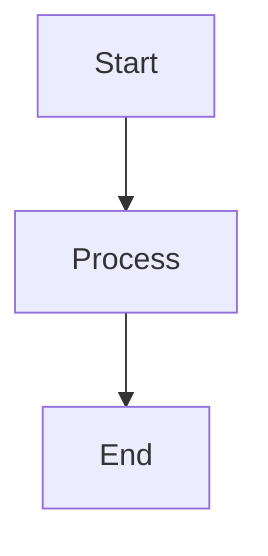

Opening paragraph that serves as the article excerpt. This should be engaging and clearly introduce the topic. It will appear in article listings and should be 1-3 sentences.

<!--more-->

## Section Heading

Main article content begins here. Use proper heading hierarchy:
- `##` for main sections
- `###` for subsections
- `####` for sub-subsections

### Subsection Example

Provide clear explanations, examples, and detailed content here.

## Key Concepts

- **Concept 1**: Definition or explanation
- **Concept 2**: Definition or explanation

### Code Examples

When including code, use appropriate language tags:

```python
# Example Python code
def example_function():
    return "Hello, World!"
```

```bash
# Example shell command
echo "Example command"
```

## Diagrams and Visualizations

### Mermaid Diagram

If using Mermaid, set `mermaid: true` in front matter:



### Mathematical Notation

If using MathJax, set `mathjax: true` in front matter:

Inline math: $E = mc^2$

Display math:

$$
\int_{-\infty}^{\infty} e^{-x^2} dx = \sqrt{\pi}
$$

## Summary

Conclude with key takeaways, summary points, or next steps.

## Further Reading

- [Link to related article]({{ '/path/to/article/' | relative_url }})
- [External resource](https://example.com)

---

**Related Articles**:
- [Article 1]({{ '/path/to/article1/' | relative_url }})
- [Article 2]({{ '/path/to/article2/' | relative_url }})
